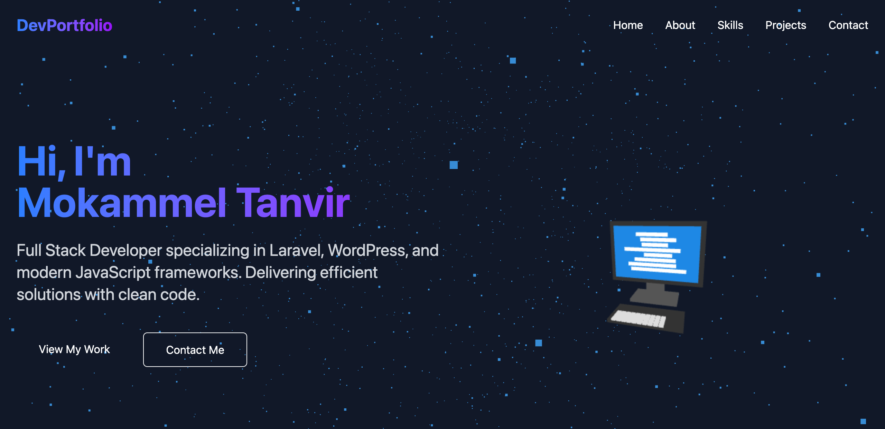

# DevPortfolio 3D - Vue.js & Three.js

A modern 3D portfolio website built with Vue.js, Three.js, and Tailwind CSS. This project serves as both a professional portfolio and a learning resource for Three.js implementation in Vue applications.



## Features

- Interactive 3D elements powered by Three.js
- Responsive design with Tailwind CSS
- Smooth animations using GSAP
- Skills section with interactive 3D card effects
- Dynamic project showcase
- Contact form
- Dark theme with modern UI

## Demo

[Live Demo](https://mokammeltanvir.com)

## Technologies Used

- Vue.js 3 (Composition API)
- Three.js for 3D graphics
- Tailwind CSS for styling
- GSAP for animations
- Vite for fast development and building

## Prerequisites

Before you begin, ensure you have the following installed:
- Node.js (v14.x or higher)
- npm or yarn

## Installation

1. Clone the repository:
   ```bash
   git clone https://github.com/mokammeltanvir/devportfolio-3d-vue.git
   ```

2. Navigate to the project directory:
   ```bash
   cd devportfolio-3d-vue
   ```

3. Install dependencies:
   ```bash
   npm install
   # or
   yarn
   ```

4. Start the development server:
   ```bash
   npm run dev
   # or
   yarn dev
   ```

5. Open your browser and visit `http://localhost:5173`

## Building for Production

To build the application for production:

```bash
npm run build
# or
yarn build
```

The built files will be in the `dist` directory.

## Project Structure

```
devportfolio-3d-vue/
├── public/             # Static assets
│   ├── screenshot.png  # Project screenshot
│   └── vite.svg        # Vite logo
├── src/
│   ├── assets/         # Images and other assets
│   ├── components/     # Vue components
│   ├── style.css       # Global CSS and Tailwind imports
│   ├── App.vue         # Main app component
│   └── main.js         # Entry point
├── index.html          # HTML template
├── vite.config.js      # Vite configuration
├── tailwind.config.js  # Tailwind CSS configuration
├── postcss.config.js   # PostCSS configuration
└── package.json        # Project dependencies
```

## Learning Three.js

This project serves as a practical example of integrating Three.js with Vue.js. Key Three.js implementations can be found in:

- `src/components/HeroSection.vue` - 3D background scene
- `src/components/ContactSection.vue` - 3D background effects
- `src/components/AboutSection.vue` - 3D elements
- `src/components/SkillsSection.vue` - 3D card effects

To learn more about Three.js:
- [Three.js Documentation](https://threejs.org/docs/)
- [Three.js Examples](https://threejs.org/examples/)

## Customization

### Changing Personal Information

1. Update the profile information in relevant component files
2. Replace social media links in `FooterSection.vue`
3. Update skills in `SkillsSection.vue`
4. Add your projects in `ProjectsSection.vue`

### Modifying 3D Elements

1. Add your 3D models in a new `src/models/` directory
2. Adjust Three.js scene parameters in respective component files

## Contributing

Contributions are welcome! Feel free to:

1. Fork the repository
2. Create a feature branch (`git checkout -b feature/amazing-feature`)
3. Commit your changes (`git commit -m 'Add some amazing feature'`)
4. Push to the branch (`git push origin feature/amazing-feature`)
5. Open a Pull Request

## Deployment

### GitHub Pages

This project is set up to deploy automatically to GitHub Pages. Follow these steps:

1. Push your code to GitHub:
   ```bash
   git remote add origin https://github.com/yourusername/devportfolio-3d-vue.git
   git push -u origin main
   ```

2. On GitHub, go to your repository settings:
   - Navigate to "Settings" > "Pages"
   - Under "Build and deployment", select "GitHub Actions" as the source
   - The site will be deployed automatically when you push to the main branch

Your site will be available at `https://yourusername.github.io/devportfolio-3d-vue/`

### Other Hosting Options

You can also deploy this site to any static site hosting service:

1. Build the project:
   ```bash
   npm run build
   ```

2. Upload the contents of the `dist` folder to your hosting provider

## License

This project is open source and available under the [MIT License](LICENSE).

## Contact

Mokammel Tanvir - [tanvir@mokammeltanvir.com](mailto:tanvir@mokammeltanvir.com)

Project Link: [https://github.com/mokammeltanvir/devportfolio-3d-vue](https://github.com/mokammeltanvir/devportfolio-3d-vue)
